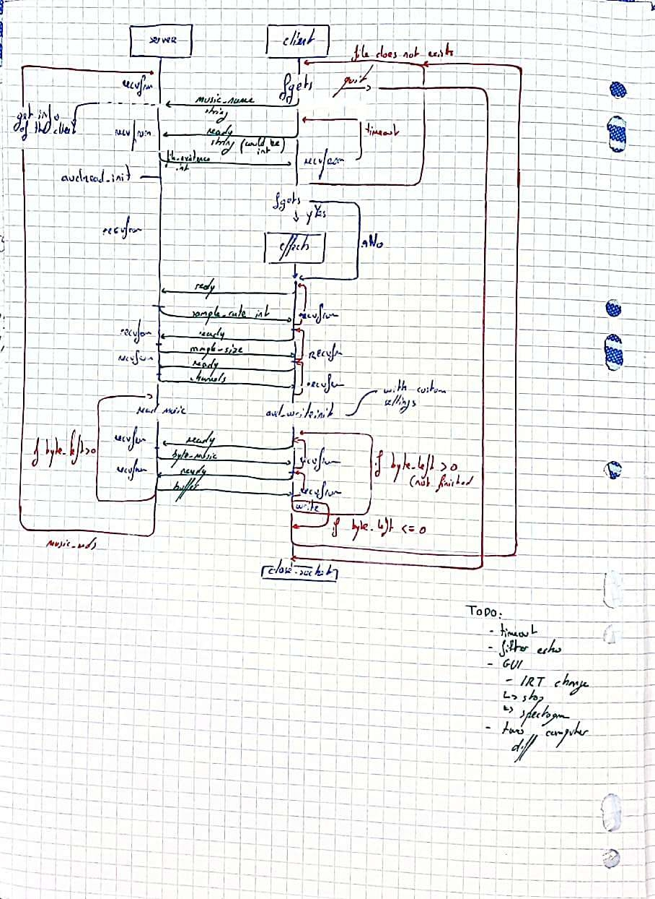

# Compte-rendu Projet de Systèmes: streaming audio

## 24-03-2023

10-02-2023 -> 24-03-2023

Gabriel DEHAYE et
Florian EPAIN
Grp 1.2

Ce TP était instructif.

Nous avons découvert le dernier bug le dernier jour.

Nous avons eu des difficultés à la fin du TP à comprendre pourquoi notre programme ne fonctionnait pas. On ne récupérait en fait pas directement le buffer envoyé par le serveur dans le buffer que nous allions lire. On utilisait un buffer intermédiaire.

## 19-04-2023

- Ajout du management de timeout en cas de perte de paquets, côté client.
- NON GÉRÉ: le serveur perd un de ses messages vers le programme client.

    Schéma d'échange d'information entre Serveur et programme client:

    (sans tous les timeouts)
    

- Ajout des filtres
  - Volume Control (uniquement en entier :/)
  - Force to mono (sans l'équillibrage)
  Il aurait fallu faire la moyenne des samples deux à deux
  - Speed Control

### TODOs

- echo
- IRT (In Real Time) modification effects
  - Stop the music, while playing (without quitting)
  - When the effects are modified,
  stop the music, recompile the fd and aud_write with the new effects and the remainding bytes
- GUI

### Idées

Echo:

- géré par le programme client
  - fonctionne pas:
  une fois une chunk de musique reçu,
  le programme se fork pour que son enfant
  joue la musique des samples précédents plus faiblement,
  en même temps que le main joue le current.
  - Multiplication des anciennes valeurs
- géré par le programme server
  - additionerai les byte du current avec les byte des précédents samples
  diminués.
